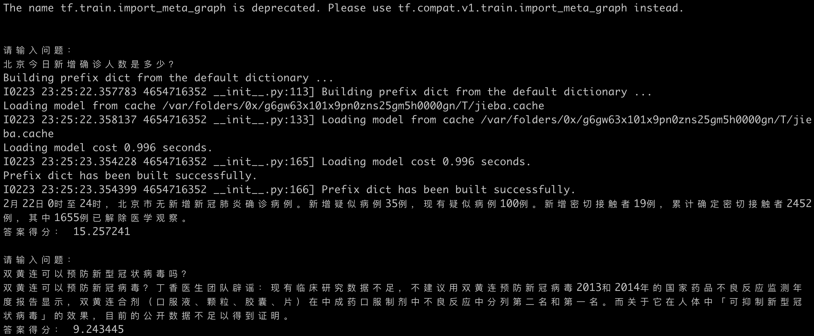

# 2019-nCov-QA
跑一遍问答的流程，一个问答系统的Demo，数据为2019肺炎新闻数据。

（目前我发现抽span的效果不理想。）

## 架构
IR + MRC
## 检索模块（IR）
使用ElasticSearch检索。

#### 1.安装ElasticSearch7和分词插件
```bash
elasticsearch-plugin install https://github.com/medcl/elasticsearch-analysis-ik/releases/download/v7.5.1/elasticsearch-analysis-ik-7.5.1.zip
```

#### 2.导入数据到Mongo并建立索引
```bash
cd ir
git clone https://github.com/BlankerL/DXY-COVID-19-Data.git
python3 import_passages.py
python3 create_es_index.py
```
 

## 阅读理解模块（MRC）
基于baidu/DuReader数据集，代码数据来自：[https://github.com/yanx27/DuReader_QANet_BiDAF](https://github.com/yanx27/DuReader_QANet_BiDAF)。

## 效果
下载data数据到mrc目录下后，然后运行`run_demo.py`即可。


链接:https://pan.baidu.com/s/18T3GPml1-jufPdsf-zpoLQ  密码:kku5